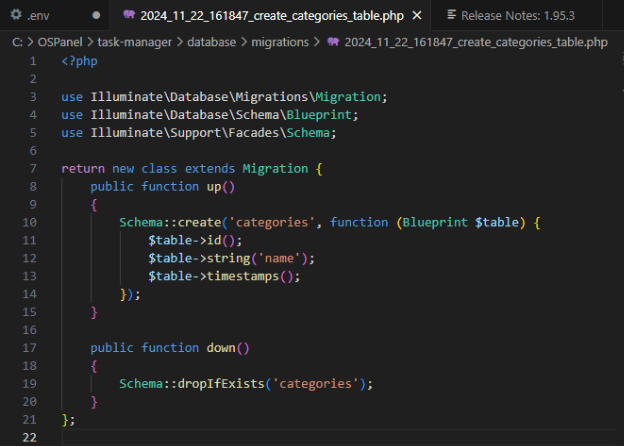
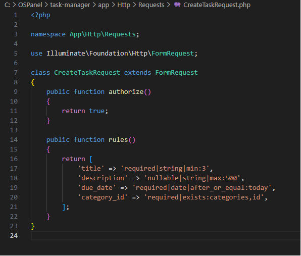
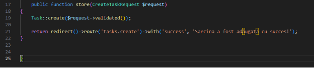
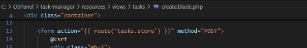

**Lucrarea de laborator Nr. 4. Formulare și validarea datelor**

**Scopul lucrării**

Familiarizarea cu elementele de bază ale creării și gestionării formularelor în **Laravel**.

Deprinderea mecanismelor de validare a datelor pe server, utilizarea regulilor de validare predefinite și personalizate, precum și învățarea gestionării erorilor și asigurarea securității datelor.

**Condiții**

În această lucrare de laborator, veți crea formulare HTML, implementați verificarea datelor pe partea de server și asigurați interacțiunea sigură cu utilizatorul, prevenind vulnerabilități precum **XSS** și **CSRF**.

№1. Pregătirea lucrării

1. Am creat proiectul și am configurat serverul astfel încat să rulez proiectul tasks-app

1. Am configurat fișierul .env și actualizat setările bazei de date:

1. Am creat baza de date:  tasks\_db

№2. Crearea formularului
### **1. Crearea modelului și migrației pentru sarcini**
1. Am rulat comanda pentru a crea modelul Task și fișierul de migrare:

1. **Fișier**: database/migrations/create\_tasks\_table.php
   Am editat migrarea pentru a include structura tabelului tasks:
   
1. Am rulat migrarea pentru a crea tabelul**:**

**2. Crearea modelului și migrației pentru categorii**

1. Am rulat comanda pentru a crea modelul Category și fișierul de migrare:

1. **Fișier**: database/migrations/ create\_categories\_table.php
   Am editat migrarea pentru tabelul categories:

1. Am editat fișierul database/seeders/DatabaseSeeder.php pentru a popula tabelul:

1. Am rulat seeder-ul:

### **3. Crearea formularului de adăugare a unei sarcini**
1. **Fișier**: resources/views/tasks/create.blade.php
   Am creat șablonul pentru formular:

1. **Controller pentru afișarea formularului și stocarea datelor**
   **Fișier**: app/Http/Controllers/TaskController.php

1. **Adăugarea rutei pentru creare și stocare**
   **Fișier**: routes/web.php

№3. Validarea datelor pe partea de server
### **1. Implementarea validării în metoda store**
1. **Fișier**: app/Http/Controllers/TaskController.php
   Am modificat metoda store pentru a implementa validarea datelor direct în controller:

1. **Afișarea erorilor în formular**
   În fișierul resources/views/tasks/create.blade.php, erorile sunt deja afișate lângă câmpuri utilizând directivele @error.

№4. Crearea unei clase de cerere personalizată (Request)

1. **Am generat clasea de Request personalizat**
   Rulând comanda:

   

1. **Fișier**: app/Http/Requests/CreateTaskRequest.php
   Am definit regulile de validare în clasa generată:

1. **Actualizați metoda store pentru a folosi CreateTaskRequest**
   Modificați metoda store din TaskController:

   

№5. Adăugarea mesajelor flash

1. **Adăugarea mesajelor flash la salvarea cu succes**
   Mesajele au fost deja adăugate în metoda store. Pentru metoda update, implementez  același mecanism.

**Fișier**: app/Http/Controllers/TaskController.php

1. **Afișarea mesajelor flash în șabloane**
   Mesajele flash sunt afișate în fișierele create.blade.php 

№6. Protecția împotriva CSRF

1. În fișierele create.blade.php și edit.blade.php, directiva @csrf este deja prezentă:

№7. Actualizarea sarcinii
### **1. Crearea formularului de editare**
1. **Fișier**: resources/views/tasks/edit.blade.php
   Am creat șablonul pentru editarea unei sarcini:

### **2. Adăugarea rutei și metodei de editare**
1. **Fișier**: routes/web.php
   Am adăugat rutele pentru editare și actualizare:

1. **Fișier**: app/Http/Controllers/TaskController.php
   Am adăugat metodele edit și update:

   

## **Întrebări de control**
1. **Ce este validarea datelor și de ce este necesară?**

   **Validarea datelor** este procesul prin care sunt verificate informațiile introduse de utilizator într-un formular sau printr-o cerere (request) pentru a asigura că acestea respectă un set de reguli predefinite, înainte de a fi procesate sau salvate în baza de date.

1. **Cum se asigură protecția formularului împotriva atacurilor CSRF în Laravel?**

   **CSRF** este un atac prin care un utilizator autenticat poate fi forțat să efectueze acțiuni pe un site fără consimțământul său. În Laravel, protecția împotriva atacurilor CSRF este implementată implicit, iar pentru a preveni astfel de atacuri, Laravel utilizează un **token CSRF** unic, care trebuie să fie inclus în fiecare formulă care trimite date prin metoda POST.

1. **Cum se creează și utilizează clasele personalizate de cerere (Request) în Laravel?**

   În Laravel, **clasele personalizate de cerere (Request)** sunt folosite pentru a centraliza logica de validare a datelor, pentru a face codul mai curat și mai ușor de întreținut. Aceste clase extind clasa FormRequest și permit definirea regulilor de validare, a mesajelor de eroare și a altor logici înainte ca datele să ajungă în controller.

1. **Cum se protejează datele împotriva atacurilor XSS la afișarea în vizualizare?**

   Protecția împotriva atacurilor XSS (Cross-Site Scripting) în Laravel la afișarea datelor în vizualizare se realizează prin **escaparea automată** a datelor.  Când afișezi date într-o vizualizare Blade folosind sintaxa {{ }}, Laravel va escapa automat caracterele speciale, precum <, >, &, etc., pentru a preveni executarea de scripturi malițioase.

